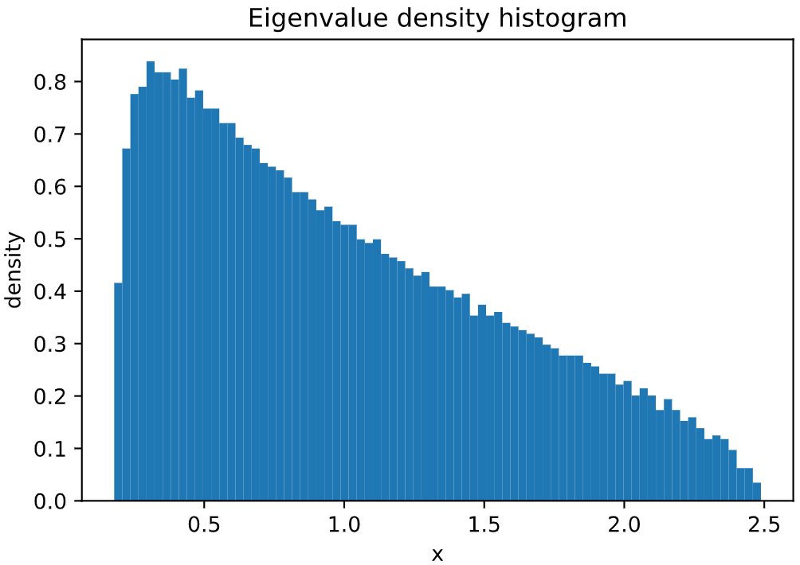
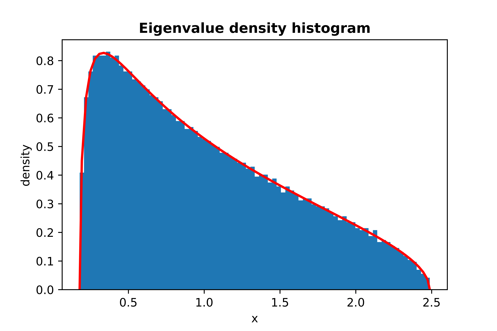
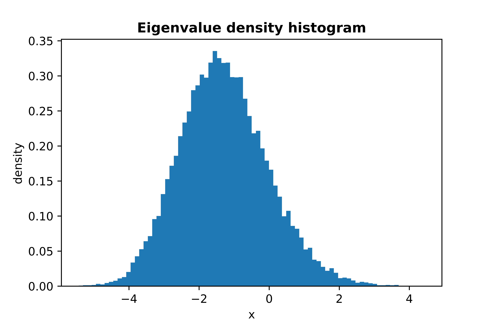

[](https://pypi.org/project/scikit-rmt/)
[](https://scikit-rmt.readthedocs.io/en/latest/?badge=latest)
[](https://travis-ci.com/AlejandroSantorum/scikit-rmt)
[](https://codecov.io/gh/AlejandroSantorum/scikit-rmt)
[](https://github.com/AlejandroSantorum/scikit-rmt/blob/main/LICENSE)
[](https://pypi.org/project/scikit-rmt)


# scikit-rmt: Random Matrix Theory Python package

Random Matrix Theory, or RMT, is the field of Statistics that analyses
matrices that their entries are random variables.

This package offers classes, methods and functions to give support to RMT
in Python. Includes a wide range of utils to work with different random
matrix ensembles, random matrix spectral laws and estimation of covariance
matrices. See documentation or visit the <https://github.com/AlejandroSantorum/scikit-rmt>
of the project for further information on the features included in the package.

-----------------
## Documentation

The documentation is available at  <https://scikit-rmt.readthedocs.io/en/latest/>,
which includes detailed information of the different modules, classes and methods of
the package, along with several examples showing different funcionalities.

-----------------
## Installation

Using a virtual environment is recommended to minimize the chance of conflicts.
However, the global installation _should_ work properly as well.

### Local installation using `venv` (recommended)

Navigate to your project directory.
```bash
cd MyProject
```

Create a virtual environment (you can change the name "env").
```bash
python3 -m venv env
```

Activate the environment "env".
```bash
source env/bin/activate
```

Install using `pip`.
```bash
pip install scikit-rmt
```
You may need to use `pip3`.
```bash
pip3 install scikit-rmt
```

### Global installation
Just install it using `pip`or `pip3`.
```bash
pip install scikit-rmt
```

### Requirements
*scikit-rmt* depends on the following packages:
* [numpy](https://github.com/numpy/numpy) - The fundamental package for scientific computing with Python
* [matplotlib](https://github.com/matplotlib/matplotlib) - Plotting with Python
* [scipy](https://github.com/scipy/scipy) - Scientific computation in Python


-----------------
## A brief tutorial

First of all, several random matrix ensembles can be sampled: **Gaussian Ensembles**, **Wishart Ensembles**,
**Manova Ensembles** and **Circular Ensembles**. As an example, the following code shows how to sample
a **Gaussian Orthogonal Ensemble (GOE)** random matrix.

```python
from skrmt.ensemble import GaussianEnsemble
# sampling a GOE (beta=1) matrix of size 3x3
goe = GaussianEnsemble(beta=1, n=3)
print(goe.matrix)
```
```bash
[[ 0.34574696 -0.10802385  0.38245343]
 [-0.10802385 -0.60113963  0.28624612]
 [ 0.38245343  0.28624612 -0.96503739]]
```
Its spectral density can be easily plotted:
```python
# sampling a GOE matrix of size 1000x1000
goe = GaussianEnsemble(beta=1, n=1000)
# plotting its spectral distribution in the interval (-2,2)
goe.plot_eigval_hist(bins=80, interval=(-2,2), density=True)
```

<!---

-->

If we sample a **non-symmetric/non-hermitian** random matrix, its eigenvalues do not need to be real,
so a **2D complex histogram** has been implemented in order to study spectral density of these type
of random matrices. It would be the case, for example, of **Circular Symplectic Ensemble (CSE)**.

```python
# sampling a CSE (beta=4) matrix of size 2000x2000
cse = CircularEnsemble(beta=4, n=1000)
cse.plot_eigval_hist(bins=80, interval=(-2.2,2.2))
```

<!---

-->

We can **boost histogram representation** using the results described by A. Edelman and I. Dumitriu
in *Matrix Models for Beta Ensembles* and by J. Albrecht, C. Chan, and A. Edelman in
*Sturm Sequences and Random Eigenvalue Distributions* (check references). Sampling certain
random matrices (**Gaussian Ensemble** and **Wishart Ensemble** matrices) in its **tridiagonal form**
we can speed up histogramming procedure. The following graphical simulation using GOE matrices
tries to illustrate it.

<!---

-->

In addition, several spectral laws can be analyzed using this library, such as Wigner's Semicircle Law,
Marchenko-Pastur Law and Tracy-Widom Law. The analytical probability density function can also be plotted
by using the `limit_pdf` argument.

Plot of **Wigner's Semicircle Law**, sampling a GOE matrix 5000x5000:
```python
from skrmt.ensemble import wigner_semicircular_law

wigner_semicircular_law(ensemble='goe', n_size=5000, bins=80, density=True)
```

<!---

-->

```python
from skrmt.ensemble import wigner_semicircular_law

wigner_semicircular_law(ensemble='goe', n_size=5000, bins=80, density=True, limit_pdf=True)
```

<!---

-->

Plot of **Marchenko-Pastur Law**, sampling a WRE matrix 5000x5000:
```python
from skrmt.ensemble import marchenko_pastur_law

marchenko_pastur_law(ensemble='wre', p_size=5000, n_size=15000, bins=80, density=True)
```

<!---

-->

```python
from skrmt.ensemble import marchenko_pastur_law

marchenko_pastur_law(ensemble='wre', p_size=5000, n_size=15000, bins=80, density=True, limit_pdf=True)
```

<!---

-->

Plot of **Tracy-Widom Law**, sampling 20000 GOE matrices of size 100x100:
```python
from skrmt.ensemble import tracy_widom_law

tracy_widom_law(ensemble='goe', n_size=500, times=20000, bins=80, density=True)
```

<!---

-->

```python
from skrmt.ensemble import tracy_widom_law

tracy_widom_law(ensemble='goe', n_size=500, times=20000, bins=80, density=True, limit_pdf=True)
```

<!---

-->

The proposed package **scikit-rmt** also provides support for **computing and analyzing** the **probability density function (PDF)** and **cumulative distribution function (CDF)** of the main random matrix ensembles. In particular, the following classes are implemented in the `ensemble.law` module:
- `WignerSemicircleDistribution` in `skrmt.ensemble.law`.
- `MarchenkoPasturDistribution` in `skrmt.ensemble.law`.
- `TracyWidomDistribution` in `skrmt.ensemble.law`.
- `ManovaSpectrumDistribution` in `skrmt.ensemble.law`.

For example, `WignerSemicircleDistribution` can be used to plot the **Wigner's Semicircle Law PDF**:
```python
import numpy as np
import matplotlib.pyplot as plt
from skrmt.ensemble.law import WignerSemicircleDistribution

x1 = np.linspace(-5, 5, num=1000)
x2 = np.linspace(-10, 10, num=2000)

fig, (ax1, ax2) = plt.subplots(1, 2, figsize=(12,4))

for sigma in [0.5, 1.0, 2.0, 4.0]:
    wsd = WignerSemicircleDistribution(beta=1, center=0.0, sigma=sigma)

    y1 = wsd.pdf(x1)
    y2 = wsd.pdf(x2)

    ax1.plot(x1, y1, label=f"$\sigma$ = {sigma} (R = ${wsd.radius}$)")
    ax2.plot(x2, y2, label=f"$\sigma$ = {sigma} (R = ${wsd.radius}$)")

ax1.legend()
ax1.set_xlabel("x", fontweight="bold")
ax1.set_xticks([-5, -4, -3, -2, -1, 0, 1, 2, 3, 4, 5])
ax1.set_ylabel("density", fontweight="bold")

ax2.legend()
ax2.set_xlabel("x", fontweight="bold")
ax2.set_xticks([-10, -8, -6, -4, -2, 0, 2, 4, 6, 8, 10])
ax2.set_ylabel("density", fontweight="bold")

fig.suptitle("Wigner Semicircle probability density function (PDF)", fontweight="bold")
plt.show()
```

<!---

-->

Similarly, `MarchenkoPasturDistribution` can be used to plot the **Marchenko-Pastur Law PDF**:
```python
import numpy as np
import matplotlib.pyplot as plt
from skrmt.ensemble.law import MarchenkoPasturDistribution

x1 = np.linspace(0, 4, num=1000)
x2 = np.linspace(0, 5, num=2000)

fig, (ax1, ax2) = plt.subplots(1, 2, figsize=(12,4))

for ratio in [0.2, 0.4, 0.6, 1.0, 1.4]:
    mpl = MarchenkoPasturDistribution(beta=1, ratio=ratio, sigma=1.0)

    y1 = mpl.pdf(x1)
    y2 = mpl.pdf(x2)

    ax1.plot(x1, y1, label=f"$\lambda$ = {ratio} ")
    ax2.plot(x2, y2, label=f"$\lambda$ = {ratio} ")

ax1.legend()
ax1.set_ylim(0, 1.4)
ax1.set_xlabel("x", fontweight="bold")
ax1.set_ylabel("density", fontweight="bold")

ax2.legend()
ax2.set_ylim(0, 1.4)
ax2.set_xlim(0, 1)
ax2.set_xlabel("x", fontweight="bold")
ax2.set_ylabel("density", fontweight="bold")

fig.suptitle("Marchenko-Pastur probability density function (PDF)", fontweight="bold")
plt.show()
```

<!---

-->

In the following example, we show how we can plot the **PDF and CDF of the Tracy-Widom distribution** using the class `TracyWidomDistribution`:
```python
import numpy as np
import matplotlib.pyplot as plt
from skrmt.ensemble.law import TracyWidomDistribution

x = np.linspace(-5, 2, num=1000)

fig, (ax1, ax2) = plt.subplots(1, 2, figsize=(12,4))

for beta in [1,2,4]:
    twd = TracyWidomDistribution(beta=beta)

    y_pdf = twd.pdf(x)
    y_cdf = twd.cdf(x)

    ax1.plot(x, y_pdf, label=f"$\\beta$ = {beta}")
    ax2.plot(x, y_cdf, label=f"$\\beta$ = {beta}")

ax1.legend()
ax1.set_xlabel("x", fontweight="bold")
ax1.set_ylabel("density", fontweight="bold")
ax1.set_title("Probability density function")

ax2.legend()
ax2.set_xlabel("x", fontweight="bold")
ax2.set_ylabel("distribution", fontweight="bold")
ax2.set_title("Cumulative distribution function")

fig.suptitle("Tracy Widom Law", fontweight="bold")
plt.show()
```

<!---

-->


The other module of this library implements **several covariance matrix estimators**:
* Sample estimator.
* Finite-sample optimal estimator (FSOpt estimator).
* Non-linear shrinkage analytical estimator (Ledoit & Wolf, 2020).
* Linear shrinkage estimator (Ledoit & Wolf, 2004).
* Empirical Bayesian estimator (Haff, 1980).
* Minimax estimator (Stain, 1982).

For certain problems, sample covariance matrix is not the best estimation for the
population covariance matrix.

The following code illustrates the usage of the estimators.
```python
from skrmt.covariance import analytical_shrinkage_estimator

# load dataset with your own/favorite function (such as pandas.read_csv)
X = load_dataset('dataset_file.data')

# get estimation
Sigma = analytical_shrinkage_estimator(X)

# ... Do something with Sigma. For example, PCA.
```

For more information or insight about the usage of the library, you can visit the official **documentation** 
<https://scikit-rmt.readthedocs.io/en/latest/> or the directory [notebooks](notebooks), that contains several
*Python notebooks* with **tutorials** and plenty of **examples**.

-----------------
## License
The package is licensed under the BSD 3-Clause License. A copy of the [license](LICENSE) can be found along with the code.

-----------------
## Main references

- James Albrecht, Cy Chan, and Alan Edelman,
    "Sturm Sequences and Random Eigenvalue Distributions",
    *Foundations of Computational Mathematics*,
    vol. 9 iss. 4 (2009), pp 461-483.
    [[pdf]](http://www-math.mit.edu/~edelman/homepage/papers/sturm.pdf)
    [[doi]](http://dx.doi.org/10.1007/s10208-008-9037-x)

- Ioana Dumitriu and Alan Edelman,
    "Matrix Models for Beta Ensembles",
    *Journal of Mathematical Physics*,
    vol. 43 no. 11 (2002), pp. 5830-5547
    [arXiv:math-ph/0206043](http://arxiv.org/abs/math-ph/0206043)

- Rowan Killip and Rostyslav Kozhan,
    "Matrix Models and Eigenvalue Statistics for Truncations of Classical Ensembles of Random Unitary Matrices",
    *Communications in Mathematical Physics*, vol. 349 (2017) pp. 991-1027.
    [arxiv.org/pdf/1501.05160.pdf](http://arxiv.org/pdf/1501.05160.pdf)

- Olivier Ledoit and Michael Wolf,
    "Analytical Nonlinear Shrinkage of Large-dimensional Covariance Matrices",
    *Annals of Statistics*, vol. 48, no. 5 (2020) pp. 3043–3065.
    [[pdf]](http://www.econ.uzh.ch/static/wp/econwp264.pdf)

- Olivier Ledoit and Michael Wolf,
    "A Well-conditioned Estimator for Large-dimensional Covariance Matrices",
    *Journal of Multivariate Analysis*, vol. 88 (2004) pp. 365–411.
    [[pdf]](http://www.ledoit.net/ole1a.pdf)

-----------------
## Attribution
This project has been developed by Alejandro Santorum Varela (2021) as part of the final degree project
in Computer Science (Autonomous University of Madrid), supervised by Alberto Suárez González.

If you happen to use `scikit-rmt` in your work or research, please cite its GitHub repository:

A. Santorum, "scikit-rmt", https://github.com/AlejandroSantorum/scikit-rmt, 2021. GitHub repository.

The corresponding BibTex entry is
```
@misc{Santorum2021,
  author = {A. Santorum},
  title = {scikit-rmt},
  year = {2021},
  howpublished = {\url{https://github.com/AlejandroSantorum/scikit-rmt}},
  note = {GitHub repository}
}
```
